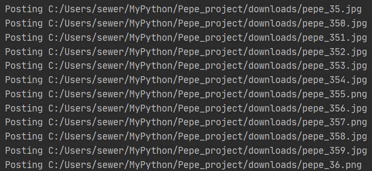
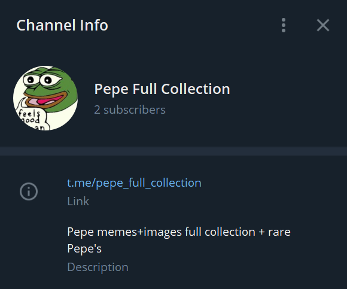

# Pepe_project

#### The main goal of this project is to create program to scrap images from website and post them to telegram channel with bot.

### !!! Telegram_Poster.py works only from local disk !!!
The reason of this is limit for access from server to local disk.

### Table of files
File | What's for
------------ | -------------
Image_scraper.py | Script download all images from [Rare-Pepe](https://rare-pepe.com/) website
Duplicate_cleaner.py | Delete same images by hashes
Telegram_poster.py | Post images from folder to [Telegram channel](https://t.me/pepe_full_collection)
Image_deleter.py | Simple script to delete images posted to channel

You can find a Pepe collection telegram channel [here](https://t.me/pepe_full_collection).
